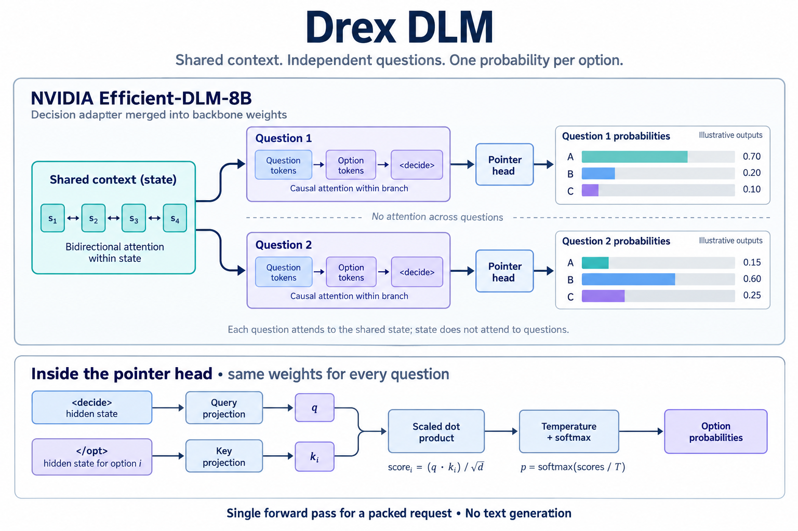

# Drex DLM

Drex DLM is a decision model from [Nace.AI](https://www.nace.ai/). Give it a document and a set of questions (yes/no, multiple choice, or a rating scale) and it returns a probability for every answer in a single forward pass. It is built on NVIDIA's [Efficient-DLM-8B](https://huggingface.co/nvidia/Efficient-DLM-8B) diffusion language model plus a small pointer head, and it serves the same `POST /v1/systemone` API as the hosted [Drex API](https://drex.nace.ai/docs), so you can run it yourself.

[BF16 weights](https://huggingface.co/nace-ai/drex-dlm) · [Q8_0 GGUF](https://huggingface.co/nace-ai/drex-dlm-Q8_0) · [llama.cpp fork](https://github.com/nace-ai/llama.cpp) (branch `edlm`) · [Ollama fork](https://github.com/nace-ai/ollama) (branch `nace-edlm`) · [Agent skill](https://github.com/nace-ai/drex-agent-skill)

**Tested on** Apple M5 Max (128 GiB), Apple M5 Pro (48 GiB) and NVIDIA H100 80 GB SXM (CUDA). CPU-only inference has not been tested. Python 3.12 is the validated interpreter. The BF16 weights take about 16 GB; memory use grows with context length and batch size.

## How it works

The shared context (`state`) uses bidirectional attention. Each question branch attends to the context and uses causal attention within itself; state tokens cannot attend to questions, and branches cannot attend to each other. A shared pointer head projects the final-layer state at the decision marker into a query and the state at each option-ending marker into a key. Scaled dot products, temperature scaling and a softmax over each question's options give the probabilities.



<sub>The diagram uses `<decide>` and `</opt>` as readable aliases for the decision and option-ending markers.</sub>

Requests within the packed-token budget run in one forward pass; larger ones are split across question rows.

Drex DLM follows the System One request format used by Jev and by [Kev](https://github.com/jaredpalmer/kev), an open-source family of Jev-style models. SDKs and servers written for that format work unchanged, and the `KEV_*` environment variables in `serve.py` come from Kev's server code.

## Performance

Drex DLM scores 52.31 on the [Decision Index 0.2](https://huggingface.co/spaces/multimodalart/jev-decision-index) leaderboard, ahead of the next five entries as of October 2026:

| Model | Index | Knowledge & Reasoning | Language Understanding | Retrieval & Classification | Tools & Automation | Arts & Human Taste |
| --- | ---: | ---: | ---: | ---: | ---: | ---: |
| Drex DLM | 52.31 | 50.71 | 57.77 | 54.25 | 48.59 | 50.25 |
| Decider chat · Gemma-4-31B | 51.93 | 44.54 | 58.91 | 50.34 | 66.99 | 38.89 |
| Jev | 51.67 | 50.54 | 59.74 | 43.35 | 66.86 | 37.86 |
| AutoJev-27B | 50.94 | 40.93 | 61.90 | 42.00 | 69.98 | 39.88 |
| Jebadiah 27B | 50.32 | 38.82 | 58.97 | 45.48 | 69.30 | 39.02 |
| simple-jev · Qwen3.8-27B | 50.21 | 36.61 | 60.16 | 50.22 | 66.95 | 37.10 |

## Quick start

```bash
git clone https://github.com/nace-ai/drex-dlm.git
cd drex-dlm
python3.12 -m venv .venv
source .venv/bin/activate
python -m pip install -r requirements.txt
hf download nace-ai/drex-dlm --local-dir ../drex-dlm-weights
python inference.py --model ../drex-dlm-weights --request examples/request.json
```

Weights go in a sibling directory. The last command prints answers for the sample ticket. To run the server instead:

```bash
python serve.py --model ../drex-dlm-weights --port 8000
curl http://127.0.0.1:8000/v1/systemone \
  -H 'Content-Type: application/json' \
  -d @examples/request.json
```

`GET /health` returns `{"status": "ok"}` once the weights are loaded.

`python onboard.py` prints the setup commands for every runner, using `../drex-dlm-weights` if present (`--weights /path/to/checkpoint` for elsewhere). Set `OLLAMA_SOURCE=/path/to/nace-edlm-checkout` if the Ollama fork isn't at `../ollama`.

The commands below assume this layout:

```text
parent/
  drex-dlm/            this repository
  drex-dlm-weights/    checkpoint, GGUF, Modelfile
  llama.cpp/           nace-ai/llama.cpp, branch edlm
  ollama/              nace-ai/ollama, branch nace-edlm
```

## Request format

| Field | What to put there |
|---|---|
| `state` | The document: a string, object, or list. Nested objects render as indented text. |
| `questions` | A dictionary of named questions. The names come back as the keys of `answers`. |

```json
{
  "state": {
    "ticket": "I was charged twice for the same order. Please refund the extra payment."
  },
  "questions": {
    "team": {
      "type": "choice",
      "instructions": "Which team should handle this ticket?",
      "criteria": {
        "billing": "Payments, charges, and refunds",
        "technical": "Bugs and outages",
        "other": "Anything else"
      }
    },
    "refund": {
      "type": "noul",
      "instructions": "Does the customer explicitly ask for a refund?"
    },
    "urgency": {
      "type": "score",
      "instructions": "How urgent is this ticket?",
      "criteria": ["Routine", "Soon", "Urgent"]
    }
  }
}
```

| Type | You supply | You get back |
|---|---|---|
| `choice` | Named options with short descriptions. Key order is option order. | `choice`, a probability per option, and `confidence` |
| `noul` | A yes/no question, with optional `criteria.true` / `criteria.false`. | `noul`, the probability of "yes" (0 to 1) |
| `score` | An ordered scale, lowest first. | A probability-weighted `score`, plus `legend`, per-level `probabilities` and `confidence` |

For `choice`, `confidence` rescales the winning probability above a uniform baseline; for `score`, it measures concentration around the modal level. The local `score` formula approximates the hosted API's.

Response from a local bfloat16 run of `examples/request.json`:

```json
{
  "answers": {
    "team": {
      "type": "choice",
      "choice": "billing",
      "confidence": 0.9461,
      "probabilities": { "billing": 0.9641, "technical": 0.001, "other": 0.0349 }
    },
    "refund": { "type": "noul", "noul": 0.8548 },
    "urgency": {
      "type": "score",
      "score": 1.4078,
      "legend": ["Routine", "Soon", "Urgent"],
      "probabilities": { "0": 0.1876, "1": 0.2169, "2": 0.5955 },
      "confidence": 0.7039
    }
  }
}
```

`usage.input_tokens` is the encoded document plus questions (87 here). `usage.output_tokens` counts the serialized answers, not generated text. `latency_ms` is the scoring time.

## Serving

| Runner | Weights | Endpoint |
|---|---|---|
| Python | `drex-dlm-weights` (includes `head.pt`) | `POST /v1/systemone`, port 8000 |
| llama-server | `drex-dlm-f16.gguf` | `POST /v1/systemone`, port 8097 |
| Ollama | the same GGUF | `POST /v1/systemone`, port 11434 |

The [Q8_0 GGUF](https://huggingface.co/nace-ai/drex-dlm-Q8_0) is a smaller option for llama-server (pointer-head matrices stay F16). Download it into the weights directory and swap its path into the command below; its model card has the tested configuration.

If the combined questions exceed the packed-token cap, the runners score question rows separately as long as the state plus each question fits the row limit.

### Python

```bash
source .venv/bin/activate
python serve.py --model ../drex-dlm-weights --host 127.0.0.1 --port 8000
```

`--model` is the directory holding the safetensors shards and `head.pt`; `--name` sets the fallback model name in responses.

### llama-server

The `edlm` architecture, GGUF converter and `/v1/systemone` endpoint live on branch `edlm` of [nace-ai/llama.cpp](https://github.com/nace-ai/llama.cpp). The fork adds the Efficient-DLM architecture and the Kev pointer head to llama.cpp. You need CMake and a C/C++ toolchain (Xcode Metal toolchain on Apple Silicon). From `drex-dlm`:

```bash
cd ..
git clone --branch edlm --single-branch https://github.com/nace-ai/llama.cpp.git llama.cpp
cmake -S llama.cpp -B llama.cpp/build
cmake --build llama.cpp/build --target llama-server --parallel 8
```

On NVIDIA, add `-DGGML_CUDA=ON` when configuring. Convert the weights to GGUF:

```bash
python3.12 -m venv llama.cpp/.venv-convert
llama.cpp/.venv-convert/bin/python -m pip install \
  -r llama.cpp/requirements/requirements-convert_hf_to_gguf.txt
llama.cpp/.venv-convert/bin/python llama.cpp/convert_hf_to_gguf.py drex-dlm-weights \
  --outfile drex-dlm-weights/drex-dlm-f16.gguf --outtype f16
cd drex-dlm
```

Start the server from `drex-dlm`:

```bash
GGML_METAL_TENSOR_DISABLE=1 ../llama.cpp/build/bin/llama-server \
  -m ../drex-dlm-weights/drex-dlm-f16.gguf \
  --host 127.0.0.1 --port 8097 \
  --embedding --pooling none \
  -c 16384 -b 16384 -ub 16384 -np 1 --no-warmup
```

Then, from another terminal:

```bash
curl http://127.0.0.1:8097/v1/systemone \
  -H 'Content-Type: application/json' -d @examples/request.json
```

Keep `GGML_METAL_TENSOR_DISABLE=1` on Apple Silicon: the Metal tensor matmul path gave incorrect results on long inputs. The flag is not needed on CUDA. Responses use the same `answers` schema as the Python server, plus `latency_ms` and an `x-typesafe-request-id` header.

### Ollama

[nace-ai/ollama](https://github.com/nace-ai/ollama), branch `nace-edlm`, launches a custom `llama-server` and forwards `POST /v1/systemone`. The fork adds System One inference support to Ollama. Finish the llama-server build and conversion above first. From `drex-dlm`, build the runner and daemon (Go 1.26; the toolchain downloads automatically):

```bash
cd ..
git clone --branch nace-edlm --single-branch https://github.com/nace-ai/ollama.git ollama
cd ollama
export OLLAMA_LLAMA_CPP_SOURCE="$PWD/../llama.cpp"
cmake -S llama/server --preset darwin
cmake --build build/llama-server-darwin --target llama-server --parallel 8
GOTOOLCHAIN=auto go build -trimpath -o ollama .
cd ../drex-dlm
```

The `darwin` preset is for Apple Silicon. Write a Modelfile next to the GGUF:

```bash
cat > ../drex-dlm-weights/Modelfile <<'EOF'
FROM ./drex-dlm-f16.gguf
CAPABILITY decision
PARAMETER num_ctx 16384
EOF
```

Start the daemon and leave it running:

```bash
OLLAMA_HOST=127.0.0.1:11434 \
OLLAMA_LLAMA_SERVER="$PWD/../ollama/build/llama-server-darwin/bin/llama-server" \
  ../ollama/ollama serve
```

In another terminal:

```bash
OLLAMA_HOST=127.0.0.1:11434 ../ollama/ollama create drex-dlm \
  -f ../drex-dlm-weights/Modelfile
curl http://127.0.0.1:11434/v1/systemone \
  -H 'Content-Type: application/json' -d @examples/request.json
```

`GET /api/version` checks readiness. The fork keeps native context, batch and microbatch capacities aligned and, on macOS, disables the Metal tensor path for eDLM runners.

## Context length

The model supports up to **32,768 tokens**. Every runner defaults to **16,384**; the full window must be enabled explicitly.

**Python:**

```bash
KEV_CONTEXT=32768 python serve.py --model ../drex-dlm-weights --port 8000
```

**llama-server.** Raise the encode cap (`SYSTEMONE_CONTEXT`) and the slot size (`-c`, `-b`, `-ub`) together:

```bash
GGML_METAL_TENSOR_DISABLE=1 SYSTEMONE_CONTEXT=32768 ../llama.cpp/build/bin/llama-server \
  -m ../drex-dlm-weights/drex-dlm-f16.gguf \
  --host 127.0.0.1 --port 8097 \
  --embedding --pooling none \
  -c 32768 -b 32768 -ub 32768 -np 1 \
  --no-warmup
```

**Ollama.** Set `PARAMETER num_ctx 32768` in the Modelfile, re-run `ollama create`, and restart the daemon with `SYSTEMONE_CONTEXT=32768`. `num_ctx` sizes the slot, decision batch and microbatch; `SYSTEMONE_CONTEXT` raises the encode cap. Keep them aligned.

`KEV_SERVE_MAX_STATE`, `KEV_SERVE_MAX_BRANCH` and `KEV_SERVE_MAX_PACKED` (Python), and the matching `SYSTEMONE_*` variables (llama-server), override individual caps. None are needed to use the full window.

## Validation

Results were checked across the Python, llama-server and Ollama runners on Apple M5 Max and M5 Pro, and across Python and llama-server on CUDA. The Q8_0 GGUF loads and serves requests through llama-server at a 16,384-token context.

## Files

| File | Purpose |
|---|---|
| `inference.py` | Score one JSON request file and print the answers |
| `serve.py` | Python server for `POST /v1/systemone` |
| `onboard.py` | Prints setup commands for the local runners |
| `examples/request.json` | The ticket used in the sample response |

The weights (`model-*-of-00004.safetensors`, about 16 GB in bfloat16, and `head.pt`, the 256-dim pointer head with temperature 1.0) are hosted on [Hugging Face](https://huggingface.co/nace-ai/drex-dlm), not in this repository.

## Integrations

The [Drex agent skill](https://github.com/nace-ai/drex-agent-skill) connects coding agents and other agentic harnesses to Drex. Its [self-hosted instructions](https://github.com/nace-ai/drex-agent-skill#self-hosted-drex) point an agent at a local `/v1/systemone` server; no API key is needed.

## License

Model weights: CC BY-NC 4.0. Code in this repository: MIT.
